<!--
  This profile README is self-contained animated SVG. All motion lives inside
  the SVG files (SMIL + CSS keyframes) because GitHub strips <script> and inline
  styles from markdown. The contribution heatmap refreshes daily via
  .github/workflows/update-profile-art.yml (no token, no third-party service).
-->

<h3><code>artunbalta@github ~ $ ./contributions.sh</code></h3>

  

<h3><code>artunbalta@github ~ $ whoami</code></h3>
<table>
  <tr>
    <td valign="top"></td>
    <td valign="top"></td>
  </tr>
</table>

